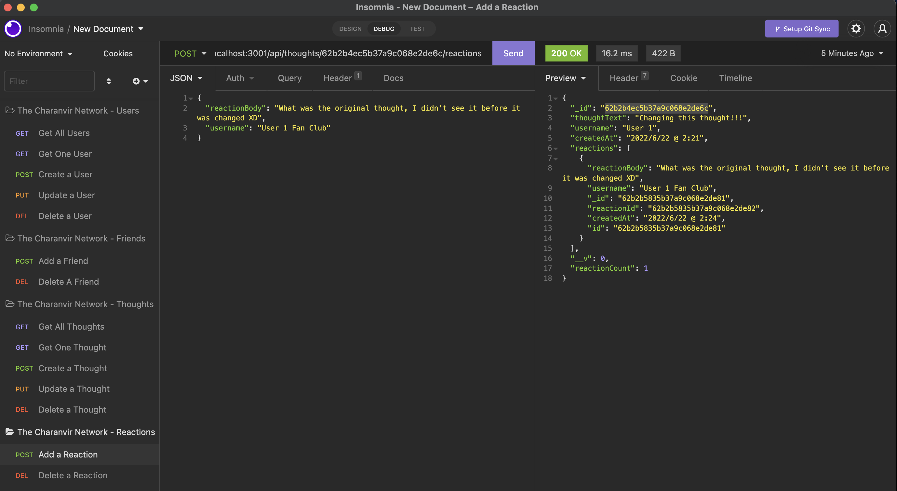

# The Charanvir Network

  

## <u>Table of Contents</u>
1. [Description](#description)
2. [Installation](#installation)
3. [Usage](#usage)
4. [Contributing](#contributing)
5. [Questions](#questions)
6. [License](#license)

## Description
***

The Charanvir Network is an API for a social network web application. It works like most social network applications, where users can be created, updated and deleted. These users can create thoughts, which can also be updated and deleted, as well as reactions. 

The Charanvir Network utilizes Express.js for routing, MongoDB for the NoSQL database, and Mongoose for the ODM. The application is currently an API, with no working frontend, but there are plans in the future to create a responsive, mobile-friendly frontend for users to enjoy and communciate and share thoughts with their friends online.

## Installation
***

To install this application get the repository link from above, either via an HTTP or SSH link. 

```
git clone 
```

Once you have the repository cloned to your local machine, navigate to the root of the repository in your terminal.

```
npm install
```

This will install all the necessary dependencies that are needed for the application to run.

## Usage
***

To use this application, navigate to the root of this repository in the terminal and enter either of the following commands:

```
npm start || node server.js
```

This will initialize the node server and allow you to access the database. By following the API routes established in the project, you can perform CRUD for Users, Thoughts and Reactions. There is no working frontend for the project at the moment, so Insomnia or other similar programs can be used to test endpoints.  

The following images show the application being used: 

 

***


***




***

The following is a link to a video which shows the various API endpoints and features: [The Charanvir Network Walkthrough Video](https://vimeo.com/722839360) 


## Contributing
***

To contribute to this application, push any enhancements and changes you code and send an email to charanvir123@gmail.com. The developer will get back to you if they wish to implement any of the code changes you've made. 

## Questions
***
To view more projects visit my [Github](https://github.com/Charanvir) account.

Direct any additional questions you have regarding this application to charanvir123@gmail.com

## License
***
The following application is covered under the MIT License
